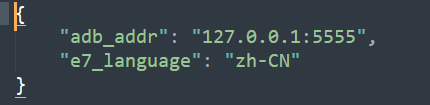

一个第七史诗自动刷新商店购买书签的小工具

## 原作者（已弃坑）

[GitHub - steven010116/epic7autoBookmark: 第七史詩刷商店的小工具](https://github.com/steven010116/epic7autoBookmark)

## 一、环境

***只支持BlueStack模拟器！！！***

0. windows10 

1. Bluestack  
     i. 版本：理论上全版本通用  
       ii. 显示：横向、1920x1080、240DPI or 320DPI   (最好320DPI，不然可能有bug)))))

2. python3.9.10  及以上版本

3. pip install -r requirements.txt  （如无法启动，则输入这行）

4. config.json  
     
       i. adb_addr填adb路径  

  ii. 目前只支持简中

## 二、使用方式
先将bluestack和第七史诗的设定调整的如上方环境相同。  
adb功能在设定=>进阶=>Android调试桥(ADB)，勾选后会看到路径。  
英文路径在settings=>Advanced=>Android Debug Bridge(ADB)。  

  

0. github绿色按钮code > download zip 整包下载后解压在同一个文件夹下，路径最好为英文避免有其他问题。
1. 参考上面的环境，缺人config.json內的参数都是对的。
2. 开启游戏，进到秘密商店后，界面会如下面这样。  

  

3. 打开小工具(main.exe)，选择条件并输入目标次数，按下开始应该就会自己动了。  
4. 之前的版本用图像辨认，而这个版本走的是android adb，已经不会抢鼠标了，甚至可以缩小放着。  
5. .exe是用pyinstaller包的，有安全疑虑的话可以自己打包 `pyinstaller -F -w -i main.ico main.py`。

[K1nakoo/epic7autoBookmark-new: 一个第七史诗自动刷新商店购买书签的小工具](https://github.com/K1nakoo/epic7autoBookmark-new)
